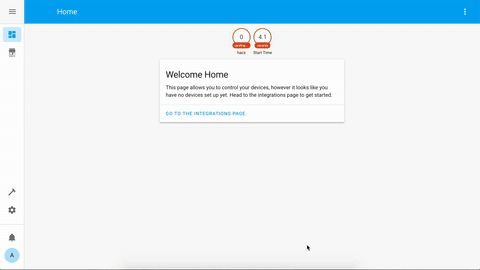

# Yandex.Station for Home Assistant

[](https://github.com/custom-components/hacs)
[](https://money.yandex.ru/to/41001428278477)

Компонент для управления [Яндекс.Станцией](https://yandex.ru/alice/station) и другими колонками с [Алисой](https://yandex.ru/alice) из [Home Assistant](https://www.home-assistant.io/).

- [Установка](#установка)
- [Настройка](#настройка)
- [Примеры использования](#примеры-использования)
  - [Обычный способ вызвать TTS](#обычный-способ-вызвать-tts)
  - [Второй способ вызвать TTS](#второй-способ-вызвать-tts)
  - [Третий способ вызвать TTS](#третий-способ-вызвать-tts)
  - [Спецэффекты в TTS](#спецэффекты-в-tts)
  - [Другие голоса](#другие-голоса)
  - [Проигрывание медиа по ссылкам](#проигрывание-медиа-по-ссылкам)
  - [Яндекс Алиса в Telegram](#яндекс-алиса-в-telegram)
  - [Морфология числительных](#морфология-числительных)
  - [Выполнение команд станцией](#выполнение-команд-станцией)
  - [Примеры управления станцией](#примеры-управления-станцией)
- [Внешний вид](#внешний-вид)
- [Продвинутое использование команд](#продвинутое-использование-команд)
- [Звук Яндекс.Станции по HDMI](#звук-яндексстанции-по-hdmi)
- [Несколько TTS в конфиге](#несколько-tts-в-конфиге)
- [Статический IP для локального режима](#статический-ip-для-локального-режима)
- [Получение команд от станции](#получение-команд-от-станции)
- [Управление умным домом Яндекса](#управление-умным-домом-яндекса)
- [Локальное управление по токену](#локальное-управление-по-токену)
- [Полезные ссылки](#полезные-ссылки)

**Новые фичи в версии 2.0:**

- **Поддержка всех колонок** через облачное управление (*не все протестированы!*)
- Одновременное управление колонками по локальной сети и через облако
- Проигрывание медиа по ссылкам ([подробнее](#проигрывание-медиа-по-ссылкам))
- Яндекс Алиса в Telegram ([подробнее](#яндекс-алиса-в-telegram))

**Список устройств**

- [Яндекс.Станция](https://station.yandex.ru/#station) (большая) - поддерживается локальное и облачное управление
- [Яндекс.Модуль](https://alice.yandex.ru/modul) - поддерживается локальное и облачное управление
- [Яндекс.Станция Мини](https://yandex.ru/alice/station-mini/index-mobile) - поддерживается локальное и облачное управление
- [Irbis A](https://yandex.ru/promo/alice/irbis-a-m) - только облачное управление
- [DEXP Smartbox](https://yandex.ru/promo/alice/dexp-smartbox-m) - только облачное управление
- [Elari SmartBeat](https://elari.net/smartbeat/) - не тестировалась
- [LG XBOOM AI ThinQ WK7Y](https://www.lg.com/ru/audio/lg-WK7Y) - не тестировалась
- [Prestigio Smartmate Mayak Edition](https://prestigio.ru/smart-speaker/smartmate) - не тестировалась

Локальное управление **не поддерживаются на стороне Яндекса**. Если на колонку "прилетит" новая прошивка с поддержкой управления - она с высокой вероятностью "подхватится" без доработки компонента.

**Внимание:** у облачного управления нет обратной связи от колонки. Неизвестно играет ли колонка что-то или стоит на паузе и какая у неё актуальная громкость. Так что состояние колонки в Home Assistant может отличаться от актуального состояния колонки, если вы давали ей команды не из компонента.

Возможности локального и облачного управления:

- **управление воспроизведением и громкостью** станции
- **отправка TTS на станцию** из окна медиаплеера и через сервисы (**голосом Алисы!**)
- **отправка любых текстовых команд** на станцию из окна медиаплеера и через сервисы (например, *включи мою музыку*)
- **спецэффекты в TTS** (библиотека звуков и наложение эффектов на голос Алисы)

Дополнительные возможности локального управления:

- **просмотр что играет на станции**, включая обложку (только для музыки)
- **перемотка треков**

#### Карточка Яндекс Станции

**Обложки работают только при локальном управлении**


#### Карточка Яндекс Мини


#### Демо

[](https://www.youtube.com/watch?v=X9wCyTFaw2E)

## Установка

Ставится через кастомный репозиторий [HACS](https://hacs.xyz/) - `AlexxIT/YandexStation`



Или через копирование папки `yandex_station` из [последнего релиза](https://github.com/AlexxIT/YandexStation/releases/latest) в папку `custom_components` (создать при необходимости) директории с конфигами.

## Настройка

Нужны имя и пароль аккаунта Яндекс, к которому привязаны колонки. Изучите код,
если думаете, что это небезопасно.

Двухфакторная авторизация работает по одноразовому паролю из приложения Яндекс.Ключ. Главное успеть за 30 секунд :)

```yaml
yandex_station:
  username: myuser
  password: mypass
```

## Примеры использования

Если у вас в конфиге есть другие TTS, например от Google - [читайте это](#несколько-tts-в-конфиге).

Для шаблонов не забывайте указывать `data_template`, для остальных команд хватит просто `data`.

Поддерживаются команды на несколько станций одновременно (как TTS, так и media_player).

**Внимание:** Для каждой вашей колонки в мобильном приложении Яндекса будет создан **служебный сценарий**. Не трогайте его. Если случайно удалили - перезапустите Home Assistant.

### Обычный способ вызвать TTS

**Работает на всех колонках**

Зависит от настройки "Режим звука" (из окна медиа-плеера). Будет или произносить текст или выполнять команду. Он же вызывается из окна медиа-плеера.

```yaml
script:
  # TTS зависит от настройки "Режим звука"! (произнести или выполнить команду)
  yandex_tts1:
    alias: TTS зависит от настройки "Режим звука"!
    sequence:
    - service: tts.yandex_station_say
      entity_id: media_player.yandex_station
      data_template:
        message: Температура в комнате {{ states("sensor.temperature_hall")|round }} градуса.
```

### Второй способ вызвать TTS

**Работает на всех колонках**

Не зависит от настройки "Режим звука".

Команда всегда отправляется через облако, даже на большой Станции, потому что это единственно известный способ, чтоб станция НЕ продолжала слушать после TTS.

**Внимание:** у Яндекса стоит ограничение на **100 символов для TTS** через облачное управление! Включая спец.символы из раздела "Спецэффекты в TTS".

```yaml
script:
  # TTS не зависит от настройки "Режим звука"! и всегда будет произносить фразу
  yandex_tts2:
    alias: TTS не зависит от настройки "Режим звука"
    sequence:
    - service: media_player.play_media
      entity_id: media_player.yandex_station
      data:
        media_content_id: Повторяю вашу фразу
        media_content_type: text
```

### Третий способ вызвать TTS

**Только для локального режима!**

Не зависит от настройки "Режим звука", но продолжает слушать после произнесения текста! Зато нет ограничения на количество символов. Поддерживает спецэффекты.

```yaml
script:
  yandex_tts3:
    alias: TTS только для локального режима
    sequence:
    - service: media_player.play_media
      entity_id: media_player.yandex_station
      data:
        media_content_id: <speaker effect="megaphone">Объявление погоды на сегодня...
        media_content_type: dialog
```

### Спецэффекты в TTS

**Работает на всех колонках**

Все колонки поддерживают эффекты, библиотеку звуков и настройка речи:

- [Настройка генерацию речи](https://yandex.ru/dev/dialogs/alice/doc/speech-tuning-docpage/)
   ```yaml
   media_content_id: смелость sil <[500]> город+а берёт
   ```
- [Наложение эффектов на голос](https://yandex.ru/dev/dialogs/alice/doc/speech-effects-docpage/)
   ```yaml
   media_content_id: <speaker effect="megaphone">Ехал Грека через реку <speaker effect="-">видит Грека в реке рак
   ```
- [Библиотека звуков](https://yandex.ru/dev/dialogs/alice/doc/sounds-docpage/)
   ```yaml
   media_content_id: <speaker audio="alice-sounds-game-win-1.opus"> У вас получилось!
   ```

```yaml
script:
  yandex_tts4:  # работает и в локальном и в облачном режиме
    alias: TTS c эффектами
    sequence:
    - service: media_player.play_media
      entity_id: media_player.yandex_station
      data:
        media_content_id: <speaker audio="alice-sounds-game-win-1.opus"> sil <[500]> Объявление погоды на сегодня...
        media_content_type: text
```

### Другие голоса

Можно использовать не только голос Алисы. Разные голоса можно посмотреть [тут](https://cloud.yandex.ru/services/speechkit).

**Внимание:** Работают не все голоса. Если указать неправильный голос - колонка заглючит. Тогда на неё нужно отправить команду **стоп** или перезагрузить.

Помните про ограничение в 100 символов при облачном управлении. Для колонок с локальным управленим можно использовать `media_content_type: dialog`. В нём нет этого ограничения.

```yaml
script:
  yandex_tts5:  # работает и в локальном и в облачном режиме
    alias: другой голос TTS
    sequence:
    - service: media_player.play_media
      entity_id: media_player.yandex_station
      data:
        media_content_id: <speaker voice="zahar">Всем привет. Меня зовут Захар...
        media_content_type: text
```

### Проигрывание медиа по ссылкам

**Поддерживается только на колонках (или модуле) с локальным управлением!**

Поддерживаются только ссылки, которые умеют устройства Яндекса!

- Песня на Яндекс.Музыке - [пример](https://music.yandex.ru/album/2150009/track/19174962)
- Альбом на Яндекс.Музыке - [пример](https://music.yandex.ru/album/2150009)
- Исполнитель на Яндекс.Музыке - [пример](https://music.yandex.ru/artist/41114)
- Плейлист на Яндекс.Музыке - [пример](https://music.yandex.ru/users/music.partners/playlists/2050)

Только на устройствах с экраном (большая Станция или Модуль)

- YouTube - [пример](https://www.youtube.com/watch?v=Rqf3J4ZOPCw)
- Кинопоиск - [пример](https://www.kinopoisk.ru/film/819101/)
- Кинопоиск HD - [пример](https://hd.kinopoisk.ru/film/4fabed06d035b5e1b87b75607927c8e5/)

Это работает в том числе из GUI, если вставить ссылку в поле "воспроизвести текст".

```yaml
script:
  yandex_play_url:
    alias: Проигрывание медиа по ссылке
    sequence:
    - service: media_player.play_media
      entity_id: media_player.yandex_station
      data:
        media_content_id: https://music.yandex.ru/album/2150009/track/19174962
        media_content_type: xxx  # тип не важен, но должен быть!
```

### Яндекс Алиса в Telegram

Вы можете общаться со своей Алисой через Telegram. И она вам будет отвечать в Telegram! Можете спросить погоду, вызвать такси, включить песню, поиграть в города или управлять вашим умным домом (если настроили интеграцию с умным домом Яндекса). Никаких слеш-команд Telegram, общайтесь с Алисой обычным текстом.

При этом Home Assistant не обязательно "прокидывать" в Интернет. Telegram в режиме `polling` может работать без внешнего доступа.

При этом [проигрывание медиа по ссылкам](#проигрывание-медиа-по-ссылкам) тоже будет работать. Просто поделитесь со своим Telegram ботом ссылкой на фильм Кинопоиска, ролик YouTube или песню/альбом/плейлист на Яндекс Музыке - и они запустятся на вашей колонке!

**Поддерживается только на колонках (или модуле) с локальным управлением!**

```yaml
telegram_bot:
- platform: polling
  api_key: TELEGRAM_BOT_API_KEY  # создайте своего Телеграм бота
  allowed_chat_ids:
  - TELEGRAM_USER1_ID  # укажите ID своего аккаунта
  - TELEGRAM_USER2_ID  # при желании, поддерживается несколько аккаунтов

automation:
- trigger:
    platform: event
    event_type: telegram_text
  action:
    service: media_player.play_media
    entity_id: media_player.yandex_station_mini  # замените на вашу станцию
    data_template:
      media_content_id: "{{ trigger.event.data.text }}"
      media_content_type: "question:{{ trigger.event.data.chat_id }}"
- trigger:
    platform: event
    event_type: yandex_station_response
  action:
    service: telegram_bot.send_message
    data_template:
      target: "{{ trigger.event.data.request_id }}"
      message: "{{ trigger.event.data.text }}"
```

Для отправки Telegram сообщений разным станциям [@ProstoMaksks](https://t.me/ProstoMaksks) предложил [такое решение](https://gist.github.com/AlexxIT/dc42882c44e298d41631720f146e701d).

### Морфология числительных

Ознакомьтесь с другим моим компонентом - [MorphNumbers](https://github.com/AlexxIT/MorphNumbers).

### Выполнение команд станцией

**Работает на всех колонках**

```yaml
script:
  yandex_command:  # работает и в локальном и в облачном режиме
    alias: Выполнить команду
    sequence:
    - service: media_player.play_media
      entity_id: media_player.yandex_station
      data:
        media_content_id: Включи мою любимую музыку вперемешку
        media_content_type: command
```

### Примеры управления станцией

**Работает на всех колонках**

```yaml
script:
  yandex_volume_set:  # в локальном или облачном режиме
    alias: Меняем громкость нескольких станций
    sequence:
    - service: media_player.volume_set
      data:
        entity_id:
        - media_player.yandex_station_12345678901234567890
        - media_player.yandex_station_98765432109876543210
        volume_level: 0.5
```

**Только для локального режима!**

```yaml
script:
  yandex_play_album:  # только в локальном режиме!!!
    alias: Включить Би-2 на Станции
    sequence:
    - service: media_player.play_media
      entity_id: media_player.yandex_station
      data:
        media_content_id: 60062    # ID альбома в Яндекс.Музыка
        media_content_type: album  # album, track or playlist
```

## Внешний вид

Красивые [иконки Яндекс устройств](https://github.com/iswitch/ha-yandex-icons) можно установить через HACS.

[](https://www.youtube.com/watch?v=lRD0nnNt5f0)

Красивый [медиа плеер](https://github.com/kalkih/mini-media-player) можно установить через HACS.

**Внимание:** правильно указывайте название вашего TTS сервиса. По умолчанию он `yandex_station`. Если вы его не изменили на `alice` по инструкции про [несколько TTS](#несколько-tts-в-конфиге). Тут `_say` на конце не нужно указывать.

Пример как настроить [карточку](https://github.com/AlexxIT/YandexStation/blob/master/yandex_mini.png) Яндекс Мини:

```yaml
entity: media_player.yandex_station_mini
shortcuts:
  attribute: sound_mode
  buttons:
    - icon: 'mdi:voice'
      id: Произнеси текст
      type: sound_mode
    - icon: 'mdi:google-assistant'
      id: Выполни команду
      type: sound_mode
    - icon: 'mdi:playlist-star'
      id: включи мою любимую музыку вперемешку
      type: command
    - icon: 'mdi:playlist-music'
      id: включи плейлист дня
      type: command
    - icon: 'mdi:heart'
      id: лайк
      type: command
    - icon: 'mdi:heart-off'
      id: снять лайк
      type: command
  columns: 6
tts:
  platform: yandex_station
type: 'custom:mini-media-player'
```

Пример как настроить [карточку](https://github.com/AlexxIT/YandexStation/blob/master/yandex_station.png) Яндекс Станции:

```yaml
entity: media_player.yandex_station
artwork: full-cover
sound_mode: icon
hide:
  sound_mode: false
  runtime: false
tts:
  platform: yandex_station
type: 'custom:mini-media-player'
```

## Продвинутое использование команд

**Только для локального режима!**

Компонент создаёт сервис `yandex_station.send_command`, которому необходимо передать команду.

Полезные команды станции можно узнать [тут](https://documenter.getpostman.com/view/525400/SWLfd8et?version=latest).

Самая универсальная - это `sendText`. Станция выполнит посланную фразу, как буд-то услышала команду голосом.

Выбрать станцию можно указав `entity_id` или `device` (для обратной совместимости). В качесте `device` может быть название станции или идентификатор. Можно посмотреть в приложении Яндекс или в [веб](https://quasar.yandex.ru/skills/iot) интерфейсе.

Если станция одна - можно ничего не указывать.

```yaml
script:
  yandex_tts:
    alias: TTS на Яндекс.Станции
    sequence:
    - service: yandex_station.send_command
      data:
        entity_id: media_player.yandex_station_12345678901234567890
        command: sendText
        text: Повтори за мной 'Привет, человек!'
```

## Звук Яндекс.Станции по HDMI

Функция переключения выхода звука находится у Яндекса в бете. На телевизор выводится только звук видео (например YouTube). Звук музыки и голос Алисы остаются на Станции.

Раньше функция включалась в конфиге. Теперь включена по умолчанию для всех владельцев больших Станций.

```yaml
script:
  yandex_hdmi_sound:
    alias: Звук Станции на HDMI
    sequence:
    - service: media_player.select_source
      entity_id: media_player.yandex_station  # поменяйте на вашу станцию
      data:
        source: HDMI
```

## Несколько TTS в конфиге

TTS Яндекса работает только с их колонками и не работает с другими, например 
Google Mini. Так и другие TTS не работают с колонками Яндекса.
 
В этом случае вы можете настроить несколько TTS сервисов. Из окна медиа плеера
всех колонок всегда будет стартовать первый повавшийся сервис (в алфавитном 
порядке). Поэтому название TTS сервиса Яндекса можно переименовать, например, в 
`alice_say` (слово `say` на конце обязательно!).

```yaml
yandex_station:
  username: myuser
  password: mypass
  tts_service_name: alice_say

tts:
- platform: google_translate
  language: ru
```

## Статический IP для локального режима

Локальные устройства ищутся автоматически по протоколу mDNS (zeroconf). Если у вас есть с этим какие-то проблемы - можно указать для них статический IP адрес на роутере.

В конфиге нужно указывать `device_id` вашей колонки. Он есть на конце `entity_id` после `media_player.yandex_station_`. Ещё его можно посмотреть в debug логах компонента и в мобильном приложении Яндекса.

```yaml
yandex_station:
  devices:
    12345678901234567890:  # device_id вашей колонки
      host: 192.168.1.123
      name: Яндекс Станция  # имя можно задать и тут
```

## Получение команд от станции

**Только для продвинутых пользователей**

Для работы функционала должна быть настроена [интеграция](https://github.com/dmitry-k/yandex_smart_home) Home Assistant с умным домом Яндекса!

1. Настройте список фраз, на которые ваши станции должны реагировать и ответы на них. Если не хотите ответ - просто поставьте точку как в примере. При первом запуске копонент создаёт служебный медиа-плеер `media_player.yandex_intents`.
2. Синхронизируйте ваши устройства в мобильном приложении Яндекса, чтоб этот плеер появился и там. Не нужно его переименовывать и перемещать в комнаты.
3. Перезапустите Home Assistant. В мобильном приложении Яндекса должны появиться ваши сценарии.

В ответ на эти фразы в Home Assistan будет генерироваться событие типа `yandex_intent` с произнесённым текстом. Теперь можете писать свои автоматизации на YAML или Node-RED.

```yaml
yandex_station:
  username: myuser
  password: mypass
  intents:
    Покажи сообщение: ага
    Какая температура в комнате: .
    Какая влажность в комнате: .

automation:
- trigger:
    platform: event
    event_type: yandex_intent
    event_data:
      text: Покажи сообщение
  action:
    service: persistent_notification.create
    data:
      title: Сообщение со станции
      message: Шеф, станция чего-то хочет
```

## Управление умным домом Яндекса

На данный момент поддерживаются:
- **Кондиционеры** - добавленные как через ИК-пульт, так и напрямую (например LG с Wi-Fi)
- **Обученные вручную ИК-команды** - обученные вручную команды ИК-пульта (Пульт => Добавить устройство => Настроить вручную)

В качестве ИК-пультов можно использовать Яндекс Пульт или более [дешевую версию от Tuya](https://www.aliexpress.com/item/32984694264.html) (добавляется напрямую как родной пульт Яндекса).

В конфиге нужно перечислить имена ваших устройств:

```yaml
yandex_station:
  username: myuser
  password: mypass
  include:
  - Кондиционер  # имя вашего кондиционера
  - Приставка  # имя не ИК-пульта, а устройства, настроенного вручную
```

Кондиционер будет добавлен как термостат:


Настроенное вручную ИК-устройство будет добавлено как [Remote](https://www.home-assistant.io/integrations/#remote). Команды отправляются через сервис `remote.send_command`. Можно отправить несколько команд за раз, настроить задержку и количество повторов.

```yaml
script:
  volume_up:
    alias: Сделай громче
    sequence:
    - service: remote.send_command
      entity_id: remote.yandex_station_remote  # поменяйте на ваше устройство
      data:
        command: Сделай громче  # имя кнопки в интерфейсе
        num_repeats: 5  # (опционально) количество повторов
        delay_secs: 0.4  # (опционально) пауза между повторами в секундах
  turn_on:
    alias: Включи телевизор
    sequence:
    - service: remote.send_command
      entity_id: remote.yandex_station_remote  # поменяйте на ваше устройство
      data:
        command: [Включи, Смени вход, Ниже, Ниже, ОК]  # можно несколько кнопок
        delay_secs: 0.4  # (опционально) пауза между повторами в секундах
```

## Локальное управление по токену

Если есть Oauth-токен с правами на Яндекс.Музыку, можно так. Не спрашивайте как его достать.

Но в этом случае будет работать только локальное управление на тех колонках, кто его поддерживает.

```yaml
yandex_station:
  token: abcdefghijklmnopqrstuvwxyz
```

## Полезные ссылки

- https://github.com/sergejey/majordomo-yadevices
- https://github.com/anVlad11/dd-alicization
