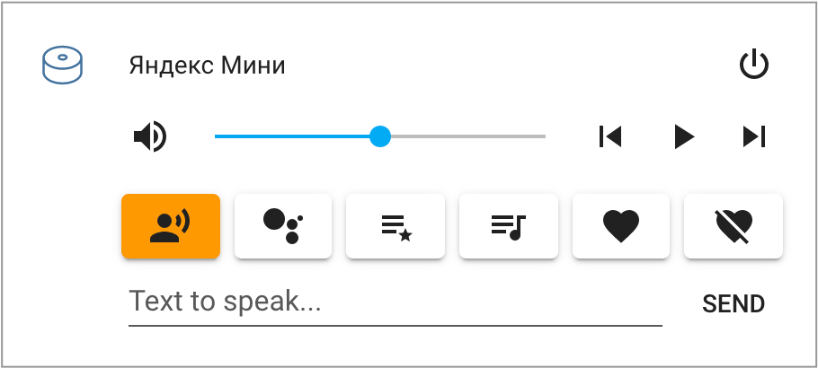
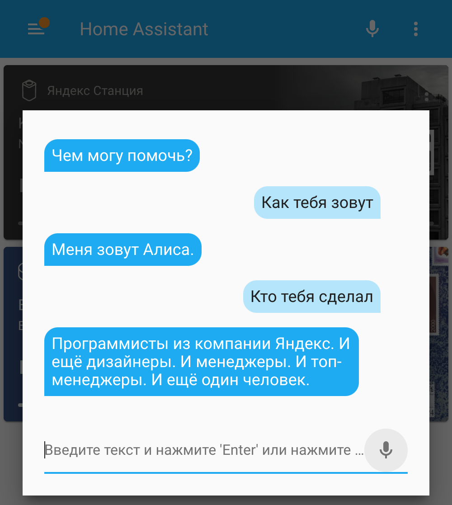
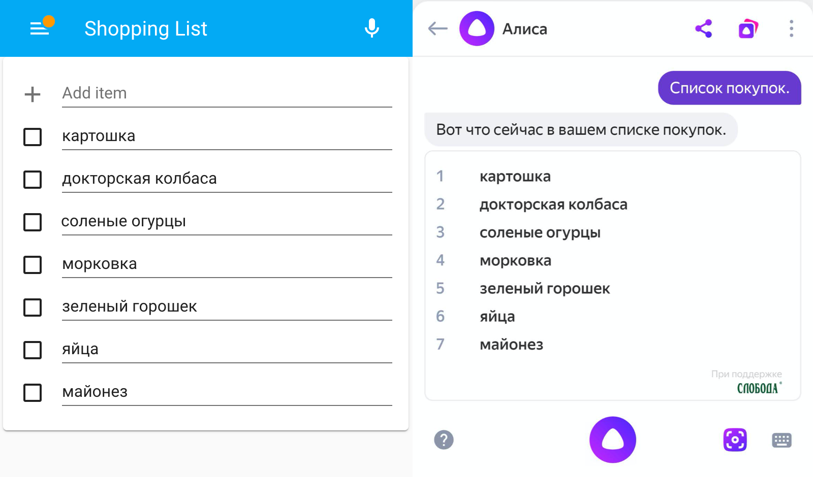
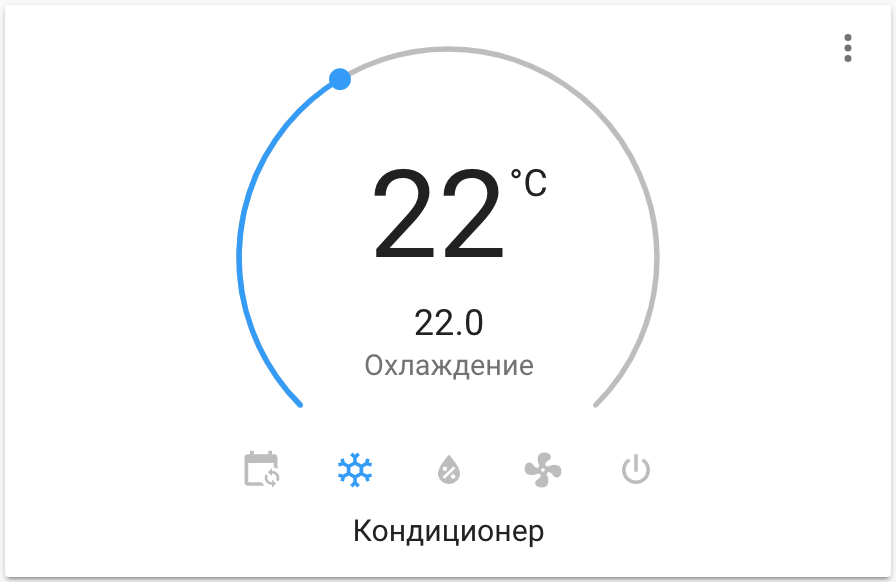

# Яндекс.Станция для Home Assistant

[](https://github.com/custom-components/hacs)
[](https://money.yandex.ru/to/41001428278477)

Компонент для управления [Яндекс.Станцией](https://yandex.ru/alice/station) и другими колонками с [Алисой](https://yandex.ru/alice) из [Home Assistant](https://www.home-assistant.io/).

- [Установка](#установка)
- [Настройка](#настройка)
- [Примеры использования](#примеры-использования)
  - [Первый способ вызвать TTS](#первый-способ-вызвать-tts)
  - [Второй способ вызвать TTS](#второй-способ-вызвать-tts)
  - [Третий способ вызвать TTS](#третий-способ-вызвать-tts)
  - [Громкость TTS](#громкость-tts)
  - [Спецэффекты в TTS](#спецэффекты-в-tts)
  - [Другие голоса](#другие-голоса)
  - [Проигрывание медиа по ссылкам](#проигрывание-медиа-по-ссылкам)
  - [Яндекс Алиса в Telegram](#яндекс-алиса-в-telegram)
  - [Яндекс Алиса в Lovelace](#яндекс-алиса-в-lovelace)
  - [Морфология числительных](#морфология-числительных)
  - [Выполнение команд станцией](#выполнение-команд-станцией)
  - [Примеры управления станцией](#примеры-управления-станцией)
  - [Список покупок](#список-покупок)
- [Внешний вид](#внешний-вид)
- [Продвинутое использование команд](#продвинутое-использование-команд)
- [Звук Яндекс.Станции по HDMI](#звук-яндексстанции-по-hdmi)
- [Статический IP для локального режима](#статический-ip-для-локального-режима)
- [Получение команд от станции](#получение-команд-от-станции)
- [Управление умным домом Яндекса](#управление-умным-домом-яндекса)
- [Полезные автоматизации](#полезные-автоматизации)
- [Полезные ссылки](#полезные-ссылки)

**Новые фичи в версии 2.0:**

- **Поддержка всех колонок** через облачное управление (*не все протестированы!*)
- Одновременное управление колонками по локальной сети и через облако
- Проигрывание медиа по ссылкам ([подробнее](#проигрывание-медиа-по-ссылкам))
- Яндекс Алиса в Telegram ([подробнее](#яндекс-алиса-в-telegram))

**Внимание**. В тексте часто используются термины локальная колонка, локальный режим и локальное управление (они несут одинаковый смысл). Внимательно изучите какие колонки его поддерживают. Функции и возможности локального управления сильно превосходят облачное управление. Локальный режим включается автоматически на поддерживаемых колонках, поробнее [тут](#статический-ip-для-локального-режима).

**Список устройств**

| Устройство                                                                        | Локальное управление | Облачное       |
| ------------------------------------------------------------                      | -------------------- | -------------- |
| [Яндекс.Станция](https://station.yandex.ru/#station) (большая)                    | Поддерживается       | Поддерживается |
| [Яндекс.Станция Макс](https://yandex.ru/alice/station-max/)                       | Поддерживается       | Поддерживается |
| [Яндекс.Станция Мини](https://yandex.ru/alice/station-mini/index-mobile)          | Поддерживается       | Поддерживается |
| [Яндекс.Модуль](https://alice.yandex.ru/modul)                                    | Поддерживается       | Поддерживается |
| [DEXP Smartbox](https://yandex.ru/promo/alice/dexp-smartbox-m)                    | Нет                  | Поддерживается |
| [Elari SmartBeat](https://elari.net/smartbeat/)                                   | Нет                  | Поддерживается |
| [Irbis A](https://yandex.ru/promo/alice/irbis-a-m)                                | Нет                  | Поддерживается |
| [LG XBOOM AI ThinQ WK7Y](https://www.lg.com/ru/audio/lg-WK7Y)                     | Нет                  | Поддерживается |
| [Prestigio Smartmate Mayak Edition](https://prestigio.ru/smart-speaker/smartmate) | Нет                  | Поддерживается |
| [JBL Link Music](https://ru.jbl.com/LINK+MUSIC+YANDEX+AI-.html)                   | Поддерживается       | Поддерживается |
| [JBL Link Portable](https://ru.jbl.com/LINK+PORTABLE+YANDEX+AI-.html)             | Поддерживается       | Поддерживается |

Локальное управление **не поддерживаются на стороне Яндекса**. Если на колонку "прилетит" новая прошивка с поддержкой управления - она с высокой вероятностью "подхватится" без доработки компонента.

**Внимание:** у облачного управления нет обратной связи от колонки. Неизвестно играет ли колонка что-то или стоит на паузе и какая у неё актуальная громкость. Так что состояние колонки в Home Assistant может отличаться от актуального состояния колонки, если вы давали ей команды не из компонента.

Возможности локального и облачного управления:

- **управление воспроизведением и громкостью** станции
- **отправка TTS на станцию** из окна медиаплеера и через сервисы (**голосом Алисы!**)
- **отправка любых текстовых команд** на станцию из окна медиаплеера и через сервисы (например, *включи мою музыку*)
- **спецэффекты в TTS** (библиотека звуков и наложение эффектов на голос Алисы)

Дополнительные возможности локального управления:

- **просмотр что играет на станции**, включая обложку (только для музыки)
- **перемотка треков**

#### Карточка Яндекс Станции

**Обложки работают только при локальном управлении**


#### Карточка Яндекс Мини



#### Демо

[](https://www.youtube.com/watch?v=X9wCyTFaw2E)

## Вопросы и ответы

В. Какой компонент лучше [YandexStation](https://github.com/AlexxIT/YandexStation) или [Yandex Smart Home](https://github.com/dmitry-k/yandex_smart_home)?  
О. Это разные компоненты для разных задач. Первый позволяет управлять вашими колонками с Алисой из Home Assistant, отправлять на них голосовые уведомления и много чего ещё. Второй позволяет добавить ваши умные устройства из Home Assistant в умный дом Яндекса и управлять ими с любого устройства с Алисой, в том числе с колонок.

## Установка

**Способ 1.** [HACS](https://hacs.xyz/)

> HACS > Интеграции > Добавить > Yandex.Station > Установить

**Способ 2.** Вручную скопируйте папку `yandex_station` из [latest release](https://github.com/AlexxIT/YandexStation/releases/latest) в директорию `/config/custom_components`.

## Настройка

**Способ 1.** GUI (рекомендуется)

> Настройки > Интеграции > Добавить интеграцию > **Yandex Station**

Если интеграции нет в списке - очистите кэш браузера.

Для авторизации используйте ваши Логин и пароль Яндекса или одноразовый пароль из приложения Яндекс.Ключ, при включенной двухфакторной авторизации.

В итоге компонент получит токен Яндекса и сохранит именно его, ваш пароль нигде не сохраняется.

Если Яндекс посчитает авторизацию подозрительной - он может потребовать ввести капчу или подтвердить ваш аккаунт в серсисе Яндекс Паспорт. Подтверждать аккаунт необходимо используя тот же Интернет/VPN, что и сервер Home Assistant.

В случае проблем с авторизацией по паролю, можно зайти в Яндекс в обычном браузере и скопировать оттуда Cookies. Компонент подскажет что нужно сделать на этапе настройки.

Так же можно перенести токен Яндекса с другого сервера Home Assistant, где уже была пройдена авторизация. Компонент подскажет что нужно сделать на этапе настройки.

**Способ 2.** YAML (устаревший) 

```yaml
yandex_station:
  username: myuser
  password: mypass
```

## Примеры использования

Если у вас в конфиге есть другие TTS, например от Google - [читайте это](#несколько-tts-в-конфиге).

Для шаблонов не забывайте указывать `data_template`, для остальных команд хватит просто `data`.

Поддерживаются команды на несколько станций одновременно (как TTS, так и media_player).

**Внимание:** Для каждой вашей колонки в мобильном приложении Яндекса будет создан **служебный сценарий**. Не трогайте его. Если случайно удалили - перезапустите Home Assistant.

### Первый способ вызвать TTS

**Работает на всех колонках**

Зависит от настройки "Режим звука" (из окна медиа-плеера). Будет или произносить текст или выполнять команду. Он же вызывается из окна медиа-плеера.

Из-за зависимости от "Режим звука" - не рекомендуется к использованию в автоматизациях. Используйте Второй способ.

```yaml
script:
  # TTS зависит от настройки "Режим звука"! (произнести или выполнить команду)
  yandex_tts1:
    alias: TTS зависит от настройки "Режим звука"!
    sequence:
    - service: tts.yandex_station_say
      entity_id: media_player.yandex_station  # замените на вашу колонку
      data_template:
        message: Температура в комнате {{ states("sensor.temperature_hall")|round }} градуса.
```

### Второй способ вызвать TTS

**Работает на всех колонках**

Не зависит от настройки "Режим звука".

**Внимание**. Команда всегда отправляется через облако, даже на локальный колонках, потому что это единственно известный способ, чтоб станция НЕ продолжала слушать после TTS.

В облачном режиме есть два ограничения:

- Команда Алисе может содержать только кириллицу, латиницу, цифры и спецсимволы: "-,!.:=?".
- Команда Алисе должна быть не длиннее 100 символов

Компонент автоматически удалит из текста запрещенные символы и ограничит длинну текста до допустимой.

```yaml
script:
  # TTS не зависит от настройки "Режим звука"! и всегда будет произносить фразу
  yandex_tts2:
    alias: TTS не зависит от настройки "Режим звука"
    sequence:
    - service: media_player.play_media
      entity_id: media_player.yandex_station  # замените на вашу колонку
      data:
        media_content_id: Повторяю вашу фразу
        media_content_type: text
```

### Третий способ вызвать TTS

**Только для локального режима!**

Не зависит от настройки "Режим звука", но продолжает слушать после произнесения текста! Зато нет ограничения на количество символов. Поддерживает спецэффекты.

```yaml
script:
  yandex_tts3:
    alias: TTS только для локального режима
    sequence:
    - service: media_player.play_media
      entity_id: media_player.yandex_station  # замените на вашу колонку
      data:
        media_content_id: <speaker effect="megaphone">Объявление погоды на сегодня...
        media_content_type: dialog
```

### Громкость TTS

**Только для локального режима!**

Колонка произнесёт текст с заданной громкостью и вернёт громкость на преждний уровень.

```yaml
script:
  alice_custom_volume1:
    sequence:
    - service: tts.yandex_station_say
      entity_id: media_player.yandex_station  # замените на вашу колонку
      data_template:
        message: Внимание! Важное сообщение...
        options:
          volume_level: 0.8
```

Или так

```yaml
script:
  alice_custom_volume2:
    sequence:
    - service: media_player.play_media
      entity_id: media_player.yandex_station  # замените на вашу колонку
      data:
        media_content_id: Внимание! Важное сообщение...
        media_content_type: text  # поддерживается text и dialog
        extra:
          volume_level: 0.8
```

### Спецэффекты в TTS

**Только для локального режима!**

Все колонки поддерживают эффекты, библиотеку звуков и настройка речи:

- [Настройка генерацию речи](https://yandex.ru/dev/dialogs/alice/doc/speech-tuning-docpage/)

  ```yaml
  media_content_id: смелость sil <[500]> город+а берёт
  ```

- [Наложение эффектов на голос](https://yandex.ru/dev/dialogs/alice/doc/speech-effects-docpage/)

  ```yaml
  media_content_id: <speaker effect="megaphone">Ехал Грека через реку <speaker effect="-">видит Грека в реке рак
  ```

- [Библиотека звуков](https://yandex.ru/dev/dialogs/alice/doc/sounds-docpage/)

  ```yaml
  media_content_id: <speaker audio="alice-sounds-game-win-1.opus"> У вас получилось!
  ```

```yaml
script:
  yandex_tts4:  # работает и в локальном и в облачном режиме
    alias: TTS c эффектами
    sequence:
    - service: media_player.play_media
      entity_id: media_player.yandex_station  # замените на вашу колонку
      data:
        media_content_id: <speaker audio="alice-sounds-game-win-1.opus"> sil <[500]> Объявление погоды на сегодня...
        media_content_type: dialog
```

### Другие голоса

**Только для локального режима!**

Можно использовать не только голос Алисы. Разные голоса можно посмотреть [тут](https://cloud.yandex.ru/services/speechkit).

**Внимание:** Работают не все голоса. Если указать неправильный голос - колонка заглючит. Тогда на неё нужно отправить команду **стоп** или перезагрузить.

```yaml
script:
  yandex_tts5:  # работает и в локальном и в облачном режиме
    alias: другой голос TTS
    sequence:
    - service: media_player.play_media
      entity_id: media_player.yandex_station  # замените на вашу колонку
      data:
        media_content_id: <speaker voice="zahar">Всем привет. Меня зовут Захар...
        media_content_type: dialog
```

### Проигрывание медиа по ссылкам

**Только для локального режима!**

Поддерживаются только ссылки, которые умеют устройства Яндекса!

- Песня на Яндекс.Музыке - [пример](https://music.yandex.ru/album/2150009/track/19174962)
- Альбом на Яндекс.Музыке - [пример](https://music.yandex.ru/album/2150009)
- Исполнитель на Яндекс.Музыке - [пример](https://music.yandex.ru/artist/41114)
- Плейлист на Яндекс.Музыке - [пример](https://music.yandex.ru/users/music.partners/playlists/2050)

Только на устройствах с экраном (большая Станция или Модуль)

- YouTube - [пример](https://www.youtube.com/watch?v=Rqf3J4ZOPCw)
- Кинопоиск - [пример](https://www.kinopoisk.ru/film/819101/)
- Кинопоиск HD - [пример](https://hd.kinopoisk.ru/film/4fabed06d035b5e1b87b75607927c8e5/)

Это работает в том числе из GUI, если вставить ссылку в поле "воспроизвести текст".

```yaml
script:
  yandex_play_url:
    alias: Проигрывание медиа по ссылке
    sequence:
    - service: media_player.play_media
      entity_id: media_player.yandex_station  # замените на вашу колонку
      data:
        media_content_id: https://music.yandex.ru/album/2150009/track/19174962
        media_content_type: xxx  # тип не важен, но должен быть!
```

### Яндекс Алиса в Telegram

**Только для локального режима!**

Вы можете общаться со своей Алисой через Telegram. И она вам будет отвечать в Telegram! Можете спросить погоду, вызвать такси, включить песню, поиграть в города или управлять вашим умным домом (если настроили интеграцию с умным домом Яндекса). Никаких слеш-команд Telegram, общайтесь с Алисой обычным текстом.

При этом Home Assistant не обязательно "прокидывать" в Интернет. Telegram в режиме `polling` может работать без внешнего доступа.

При этом [проигрывание медиа по ссылкам](#проигрывание-медиа-по-ссылкам) тоже будет работать. Просто поделитесь со своим Telegram ботом ссылкой на фильм Кинопоиска, ролик YouTube или песню/альбом/плейлист на Яндекс Музыке - и они запустятся на вашей колонке!

```yaml
telegram_bot:
- platform: polling
  api_key: TELEGRAM_BOT_API_KEY  # создайте своего Телеграм бота
  allowed_chat_ids:
  - TELEGRAM_USER1_ID  # укажите ID своего аккаунта
  - TELEGRAM_USER2_ID  # при желании, поддерживается несколько аккаунтов

automation:
- trigger:
    platform: event
    event_type: telegram_text
  action:
    service: media_player.play_media
    entity_id: media_player.yandex_station_mini  # замените на вашу станцию
    data_template:
      media_content_id: "{{ trigger.event.data.text }}"
      media_content_type: "question:{{ trigger.event.data.chat_id }}"
- trigger:
    platform: event
    event_type: yandex_station_response
  action:
    service: telegram_bot.send_message
    data_template:
      target: "{{ trigger.event.data.request_id }}"
      message: "{{ trigger.event.data.text }}"
```

Для отправки Telegram сообщений разным станциям [@ProstoMaksks](https://t.me/ProstoMaksks) предложил [такое решение](https://gist.github.com/AlexxIT/dc42882c44e298d41631720f146e701d).

### Яндекс Алиса в Lovelace

**Только для локального режима!**



Вы можете общаться со своей Алисой через GUI Home Assistant ([lovelace](https://www.home-assistant.io/lovelace/)). Это работает в любом браузере на любой платформе, включая смартфоны и официальные мобильные приложения.

При включении компонента [Conversation](https://www.home-assistant.io/integrations/conversation/) в правом верхнем углу интерфейса Home Assistant появляется микрофон. Сам компонент позволяет общаться в режиме диалога.

Работает аналогично добавлению Алисы в Телеграм. Вы фактически общаетесь в текстовом режиме с одной из ваших колонок. Отправка ссылок на медиа тоже работает!

```yaml
conversation:
  intents:
    # менять нужно entity_id до двоеточия, после двоеточия ничего менять не надо!
    media_player.yandex_station_mini: [.+]  # замените на вашу станцию
```

Компонет поддерживает не только текстовый, но и голосовой ввод при следующих условиях:

- *Home Assistant открыт в браузере Google Chrome на Windows, macOS, Linux, Android или в мобильном приложении Android* - потому что для распознования голоса используются API Google
- *Home Assistant открыт по HTTPS-ссылке или localhost-ссылке* - потому что микрофон в браузере Google Chrome доступен только в этом случае

По умолчанию в Home Assistant включен голосовой ввод только на английском языке. Чтоб это исправить - добавьте в конфиг такую настройку. Если у вас голосовой ввод не работает или он вам не нужен - настройку добавлять не надо! Общаться текстом с Алисой вы можете и без неё. После изменения вероятно потребуется сбросить кэш браузера (включая cookies and other site data).

```yaml
yandex_station:
  recognition_lang: ru-RU
```

Текстовый ввод работает в любом браузере на любой платформе, включая мобильные приложения.

### Морфология числительных

Для правильного произношения числительных в TTS, ознакомьтесь с другим моим компонентом - [MorphNumbers](https://github.com/AlexxIT/MorphNumbers).

### Выполнение команд станцией

**Работает на всех колонках**

```yaml
script:
  yandex_command:  # работает и в локальном и в облачном режиме
    alias: Выполнить команду
    sequence:
    - service: media_player.play_media
      entity_id: media_player.yandex_station  # замените на вашу колонку
      data:
        media_content_id: Включи мою любимую музыку вперемешку
        media_content_type: command
```

### Примеры управления станцией

**Работает на всех колонках**

```yaml
script:
  yandex_volume_set:  # в локальном или облачном режиме
    alias: Меняем громкость нескольких станций
    sequence:
    - service: media_player.volume_set
      data:
        entity_id:
        - media_player.yandex_station_12345678901234567890
        - media_player.yandex_station_98765432109876543210
        volume_level: 0.5
```

**Только для локального режима!**

```yaml
script:
  yandex_play_album:  # только в локальном режиме!!!
    alias: Включить Би-2 на Станции
    sequence:
    - service: media_player.play_media
      entity_id: media_player.yandex_station  # замените на вашу колонку
      data:
        media_content_id: 60062    # ID альбома в Яндекс.Музыка
        media_content_type: album  # album, track or playlist
```

### Список покупок

**Только для локального режима!**

Поддерживается двухсторонняя синхронизация списка покупок Алисы и стандартного компонента [Shopping List](https://www.home-assistant.io/integrations/shopping_list/). Можно добавлять и удалять элементы списка как из ХА, так и голосом с колонки.



Предварительно необходимо добавить стандартный компонент, через GUI или YAML.

Для синхронизации списков необходимо вызвать следующий сервис. При желании, вызов этого сервиса можно выполнять голосом с колонки, настроив интеграцию с Умным домом Яндекса. 

```yaml
script:
  update_shopping_list:
    alias: Обновить список покупок
    sequence:
      - service: media_player.play_media
        entity_id: media_player.yandex_station_mini  # замените на вашу колонку
        data:
          media_content_id: update
          media_content_type: shopping_list
```

После синхронизации вы можете удалять элементы голосом на колонке. Такие элементы будут удалены из ХА при следующей синхронизации, даже если на них не стоит галка.

Или вы можете отмечать элементы как завершенные в интерфейсе ХА. Такие элементы будут удалены из Яндекса при следующей синхронизации. Только не очищайте вручную список завершенных элементов в ХА до синхронизации! Иначе синхронизация нарушится.

Синхронизация происходит по следующим правилам:
1. Завершенные (отмеченные) элементы списка ХА - удаляются из Яндекса (если они там были)
2. Новые элементы, созданные именно из ХА - добавляются в Яндекс (если их там не было)
3. Список ХА полностью заменяется тем, что получилось в Яндексе после 1 и 2
4. Список завершенных элементов ХА очищается

Нужно учитывать, что некоторые названия Яндекс не может добавить в свой список. Поэтому они могут бесследно пропасть.

## Внешний вид

Красивые [иконки Яндекс устройств](https://github.com/iswitch/ha-yandex-icons) можно установить через HACS.

[](https://www.youtube.com/watch?v=lRD0nnNt5f0)

**Внимание**. Ниже пример нестандартной карточки медиалеера. Её нет в Home Assistant по умолчанию. Она легко ставится через [HACS](https://github.com/kalkih/mini-media-player). Если у вас сложности с установкой - просто используйте стандартную карточку. Она тоже работает.

```yaml
entity: media_player.yandex_station_mini  # поменяйте на вашу колонку
artwork: cover
sound_mode: icon
shortcuts:
  attribute: sound_mode
  buttons:
    - icon: 'mdi:account-voice'
      id: Произнеси текст
      type: sound_mode
    - icon: 'mdi:robot'
      id: Выполни команду
      type: sound_mode
    - icon: 'mdi:playlist-star'
      id: включи мою любимую музыку вперемешку
      type: command
    - icon: 'mdi:playlist-music'
      id: включи плейлист дня
      type: command
    - icon: 'mdi:heart'
      id: лайк
      type: command
    - icon: 'mdi:heart-off'
      id: снять лайк
      type: command
  columns: 6
hide:
  sound_mode: false
  runtime: false
tts:
  platform: yandex_station
type: 'custom:mini-media-player'
```

## Продвинутое использование команд

**Только для локального режима!**

Компонент создаёт сервис `yandex_station.send_command`, которому необходимо передать команду.

Полезные команды станции можно узнать [тут](https://documenter.getpostman.com/view/525400/SWLfd8et?version=latest).

Самая универсальная - это `sendText`. Станция выполнит посланную фразу, как буд-то услышала команду голосом.

Выбрать станцию можно указав `entity_id` или `device` (для обратной совместимости). В качесте `device` может быть название станции или идентификатор. Можно посмотреть в приложении Яндекс или в [веб](https://quasar.yandex.ru/skills/iot) интерфейсе.

Если станция одна - можно ничего не указывать.

```yaml
script:
  yandex_tts:
    alias: TTS на Яндекс.Станции
    sequence:
    - service: yandex_station.send_command
      data:
        entity_id: media_player.yandex_station_12345678901234567890
        command: sendText
        text: Повтори за мной 'Привет, человек!'
```

## Звук Яндекс.Станции по HDMI

**Только для большой Яндекс.Станции!**

Функция переключения выхода звука находится у Яндекса в бете. На телевизор выводится только звук видео (например YouTube). Звук музыки и голос Алисы остаются на Станции.

Раньше функция включалась в конфиге. Теперь включена по умолчанию для всех владельцев больших Станций.

```yaml
script:
  yandex_hdmi_sound:
    alias: Звук Станции на HDMI
    sequence:
    - service: media_player.select_source
      entity_id: media_player.yandex_station  # поменяйте на вашу станцию
      data:
        source: HDMI
```

## Статический IP для локального режима

**Только для локального режима!**

Проще всего проверить работу локального режима - запустить на колонке песню и посмотреть, отображается ли обложка в Home Assistant.

Локальные устройства ищутся автоматически по протоколу mDNS (zeroconf). Если у вас есть с этим какие-то проблемы - можно указать для них статический IP адрес на роутере.

mDNS не будет работать, если вы открыли только один порт для Home Assistant. Например установка в Docker без настройки `network=host` (в Hass.io всё хорошо) или виртуальная машина с NAT.

В конфиге нужно указывать `device_id` вашей колонки. Он есть на конце `entity_id` после `media_player.yandex_station_`. Ещё его можно посмотреть в debug логах компонента и в мобильном приложении Яндекса.

```yaml
yandex_station:
  devices:
    12345678901234567890:  # device_id вашей колонки
      host: 192.168.1.123
      name: Яндекс Станция  # имя можно задать и тут
```

## Получение команд от станции

**Только для продвинутых пользователей**

Для работы функционала должна быть настроена [интеграция](https://github.com/dmitry-k/yandex_smart_home) Home Assistant с умным домом Яндекса!

1. Настройте список фраз, на которые ваши станции должны реагировать и ответы на них. Если не хотите ответ - оставьте его пустым (двоеточие обязательно). При первом запуске копонент создаёт служебный медиа-плеер `media_player.yandex_intents`.
2. Синхронизируйте ваши устройства в мобильном приложении Яндекса, чтоб этот плеер появился и там. Не нужно его переименовывать и перемещать в комнаты.
3. Перезапустите Home Assistant. В мобильном приложении Яндекса должны появиться ваши сценарии.

В ответ на эти фразы в Home Assistan будет генерироваться событие типа `yandex_intent` с произнесённым текстом. Теперь можете писать свои автоматизации на YAML или Node-RED.

```yaml
yandex_station:
  username: myuser
  password: mypass
  intents:
    Покажи сообщение: ага
    Какая температура в комнате:
    Какая влажность в комнате:

automation:
- trigger:
    platform: event
    event_type: yandex_intent
    event_data:
      text: Покажи сообщение
  action:
    service: persistent_notification.create
    data:
      title: Сообщение со станции
      message: Шеф, станция чего-то хочет
```

## Управление умным домом Яндекса

На данный момент поддерживаются:

- **Кондиционеры** - добавленные как через ИК-пульт, так и напрямую (например LG с Wi-Fi)
- **Телевизоры** - добавленные как через ИК-пульт, так и напрямую
- **Обученные вручную ИК-команды** - обученные вручную команды ИК-пульта (Пульт => Добавить устройство => Настроить вручную)
- **Розетки** - включая энергопотребление
- **Лампочки** - включая настройку яркости и цвета
- **Обогреватели**
- **Пылесосы**

В качестве ИК-пультов можно использовать Яндекс Пульт или более [дешевую версию от Tuya](https://www.aliexpress.com/item/32984694264.html) (добавляется напрямую как родной пульт Яндекса).

В конфиге нужно перечислить имена ваших устройств:

```yaml
yandex_station:
  username: myuser
  password: mypass
  include:
  - Кондиционер  # имя вашего кондиционера
  - Приставка  # имя не ИК-пульта, а устройства, настроенного вручную
```

Кондиционер будет добавлен как термостат:



Настроенное вручную ИК-устройство будет добавлено как [Remote](https://www.home-assistant.io/integrations/#remote). Команды отправляются через сервис `remote.send_command`. Можно отправить несколько команд за раз, настроить задержку и количество повторов.

```yaml
script:
  volume_up:
    alias: Сделай громче
    sequence:
    - service: remote.send_command
      entity_id: remote.yandex_station_remote  # поменяйте на ваше устройство
      data:
        command: Сделай громче  # имя кнопки в интерфейсе
        num_repeats: 5  # (опционально) количество повторов
        delay_secs: 0.4  # (опционально) пауза между повторами в секундах
  turn_on:
    alias: Включи телевизор
    sequence:
    - service: remote.send_command
      entity_id: remote.yandex_station_remote  # поменяйте на ваше устройство
      data:
        command: [Включи, Смени вход, Ниже, Ниже, ОК]  # можно несколько кнопок
        delay_secs: 0.4  # (опционально) пауза между повторами в секундах
```

## Полезные автоматизации

[](https://www.youtube.com/watch?v=XLoGvy4RLrg)

- [Отображаем статус Яндекс Станции с помощью умных ламп](https://gist.github.com/AlexxIT/c275ee512bef01ed4d3b0aebc12caef4), так же эту автоматизацию можно переделать в "Приглушаем звук телевизора, когда Алиса слушает", **Только для локального режима!**
- [Звонок на колонку с Алисой](https://gist.github.com/AlexxIT/5dd25dbe3306d673ad013f05617a8056)
- [Перехват фраз с локальных колонок](https://gist.github.com/AlexxIT/d4995839aedde2bbcf822831a71a52c5), **Только для локального режима!**
- [Отвечать на intents с последней активной колонки](https://gist.github.com/AlexxIT/6a3a1a5ba4c4ebe1fabbec639542d446), **Только для локального режима!**
- [Управление разными станциями из Telegram](https://gist.github.com/AlexxIT/dc42882c44e298d41631720f146e701d), **Только для локального режима!**
- [Действие по таймеру в Яндекс Алисе](https://gist.github.com/AlexxIT/5fb8fd32378cdc16c729f15d7a1bab28)
- [Список радиостанций для колонок Яндекса](https://gist.github.com/AlexxIT/b2a435adb30b9bf91022fccc95267b9b)

## Полезные ссылки

- https://github.com/sergejey/majordomo-yadevices
- https://github.com/anVlad11/dd-alicization
