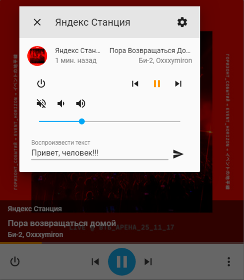

# YandexStation for Home Assistant

Компонент для управления Яндекс.Станцией по локальной сети.

На начало февраля 2020 поддерживается:

- Яндекс.Станция (большая)
- Яндекс.Модуль (у меня нет, но по отзывам работает)

Не поддерживается:

- Яндекс.Станция Мини
- Irbis
- Dexp

Колонки **не поддерживаются на стороне Яндекса**. Если на колонку "прилетит" новая прошивка с поддержкой управления - она с высокой вероятностью "подхватится" без доработки компонента.

Остальные колонки не тестировались.



## Настройка

Нужны имя и пароль аккаунта Яндекс, к которому привязаны колонки. Изучите код,
если думаете, что это небезопасно.

Токен сохраняется в директории конфигов и больше не запрашивается.

```yaml
yandex_station:
  username: myuser
  password: mypass
```

Если знаете свой Oauth-токен, можно так:

```yaml
yandex_station:
  token: abcdefghijklmnopqrstuvwxyz
```

## Пример использования

```yaml
script:
  yandex_tts:
    alias: TTS на Яндекс.Станции
    sequence:
    - service: tts.yandex_station_say
      data_template:
        entity_id: media_player.yandex_station_12345678901234567890
        message: Температура в комнате {{ states("sensor.temperature_hall")|round }} градуса.

  yandex_play_album:
    alias: Включить Би-2 на Станции
    sequence:
    - service: media_player.play_media
      data:
        entity_id: media_player.yandex_station_12345678901234567890
        media_content_id: 60062    # ID альбома в Яндекс.Музыка
        media_content_type: album  # album, track or playlist

  yandex_volume_set:
    alias: Меняем громкость нескольких станций
    sequence:
    - service: media_player.volume_set
      data:
        entity_id:
        - media_player.yandex_station_12345678901234567890
        - media_player.yandex_station_98765432109876543210
        volume_level: 0.5

  yandex_hdmi_sound:
    alias: Звук Станции на HDMI
    sequence:
    - service: media_player.select_source
      data:
        entity_id: media_player.yandex_station_12345678901234567890
        source: HDMI
```

Для шаблонов не забывайте указывать `data_template`, для остальных команд 
хватит просто `data`.

Поддерживаются команды на несколько станций одновременно (как TTS, так и 
media_player).

## Продвинутое использование

Компонент создаёт сервис `yandex_station.send_command`, которому необходимо 
передать команду.

Полезные команды станции можно узнать [тут](https://documenter.getpostman.com/view/525400/SWLfd8et?version=latest).

Самая универсальная - это `sendText`. Станция выполнит посланную фразу, как 
буд-то услышала команду голосом.

Если у аккаунта больше одной станции - команда выполнится на первой из 
поддерживаемых. Если поддерживаемых станций несколько - нужно дополнительно 
передать `device` равный `id` или названию станции. Можно посмотреть в 
приложении Яндекс или в [веб](https://quasar.yandex.ru/skills/iot) интерфейсе.

```yaml
script:
  yandex_tts:
    alias: TTS на Яндекс.Станции
    sequence:
    - service: yandex_station.send_command
      data:
        command: sendText
        text: Повтори за мной 'Привет, человек!'
        device: Яндекс Станция
```

## Звук Яндекс.Станции по HDMI

Я решил не включать эту функцию в базовую конфигурацию. Она использует совсем
другие API Яндекса и требует дополнительной авторизации в сервисах Яндекса. 

Сама функция переключения выхода звука находится у Яндекса в бете. В отличии 
от обычного управления станцией - функция меняет её настройки. Поэтому 
пользуйтесь на свой страх и риск.

Включается в файле конфигурации:

```yaml
yandex_station:
  username: myuser
  password: mypass
  control_hdmi: true
```

## Несколько TTS

TTS Яндекса работает только с их колонками и не работает с другими, например 
Google Mini. Так и другие TTS не работают с колонками Яндекса.
 
В этом случае вы можете настроить несколько TTS сервисов. Из окна медиа плеера
всех колонок всегда будет стартовать первый повавшийся сервис (в алфавитном 
порядке). Поэтому название TTS сервиса Яндекса можно переименовать, например, в 
`alice_say` (слово `say` на конце обязательно!).

```yaml
yandex_station:
  username: myuser
  password: mypass
  tts_service_name: alice_say

tts:
- platform: google_translate
  language: ru
```

## Полезные ссылки

[CHANGELOG](CHANGELOG.md)

- https://github.com/sergejey/majordomo-yadevices
- https://github.com/anVlad11/dd-alicization